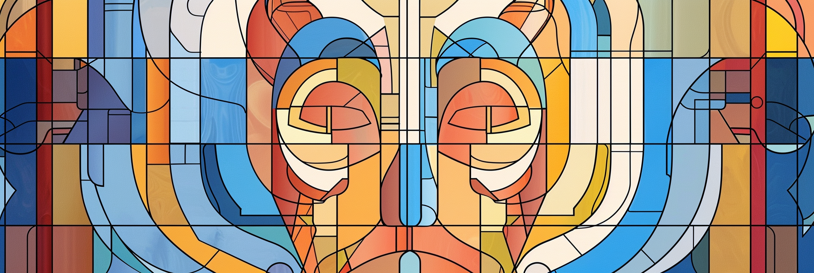

# Homiletiek Feedback
## Systematische feedback op preken

**Bekijk voorbeelden van structurele feedback:** [wmotte.github.io/homiletiek_feedback](https://wmotte.github.io/homiletiek_feedback/)

---

### Het belang van feedback voor voorgangers

Preken is het centrale ambacht van het predikantschap. Een dominee die niet kan preken is, zoals Dr. W.M. Dekker het formuleert, "als een fietsenmaker die het wiel van de fiets niet goed monteert." Toch is het opvallend hoe weinig structurele, inhoudelijk-theologische feedback voorgangers ontvangen op hun preken.

Na een eredienst krijgt een predikant vaak algemene complimenten ("mooie preek") of praktische opmerkingen ("te lang"), maar zelden een grondige theologische analyse:
- Was de uitleg van de Schrift adequaat?
- Kwam de toepassing voldoende concreet?
- Werd de hoorder werkelijk in de tekst getrokken?
- Was Christus het telos van de preek?

**Structurele feedback is essentieel** voor de groei van elke voorganger. Net zoals een kunstenaar zijn werk laat recenseren of een wetenschapper zijn publicatie aan peer review onderwerpt, zo verdient ook de prediking systematische evaluatie aan de hand van heldere criteria.

Dit project biedt een hulpmiddel voor die evaluatie - door te illustreren hoe een grondige, professionele *feedback loop* zou kunnen functioneren.

---

### Wat doet dit project?

Dit project biedt drie complementaire methoden voor de systematische analyse van preken aan:

#### 1. De Leercyclus van Kolb (Homiletic Window)
Analyseert of de preek de volledige cyclus van ervaringsgericht leren doorloopt, zodat verschillende typen hoorders (leerstijlen) worden aangesproken. Dit is gebaseerd op de homiletische typologie van **Kenton Anderson**:

- **Concrete Ervaring** (Visionaire structuur - *Waarom is dit belangrijk?*)
- **Reflectieve Observatie** (Narratieve structuur - *Wat gebeurt er?*)
- **Abstracte Conceptualisering** (Declaratieve structuur - *Wat is de waarheid?*)
- **Actief Experimenteren** (Pragmatische structuur - *Hoe werkt het?*)

**Achtergrond:** De volledige theoretische onderbouwing is te vinden in `misc/kolbs_leercyclus.md`.

#### 2. De Thesen van Dekker
Analyseert preken aan de hand van de **acht thesen** die Dr. Willem Maarten Dekker formuleerde in zijn artikel **"Wat is een preek? Thesen"** (*In de Waagschaal*, nr. 2, 8 februari 2025). Deze criteria focussen op de theologische kern en de klassieke 3-2-1-regel (3 stukken, 2 wegen, 1 Heer):

1. **Specifiek Bijbelgedeelte** - Ligt één specifieke pericoop ten grondslag?
2. **Exegese** - Is er adequate uitleg van de oorspronkelijke context?
3. **Toepassing** - Is de actualisering concreet en niet algemeen?
4. **Verwevenheid** - Zijn uitleg en toepassing met elkaar verweven?
5. **Drie stukken** - Zijn ellende, verlossing en dankbaarheid aanwezig?
6. **Twee wegen** - Wordt de ernst van de menselijke keuze zichtbaar?
7. **Christocentrisch** - Is Christus het telos van de preek?
8. **Diepgang en lengte** - Duurt de preek minimaal 20 minuten?

#### 3. De Aristotelische Modi (Rhetorical Triangle)
Analyseert preken aan de hand van de klassieke retorica van **Aristoteles**: Logos, Pathos en Ethos. Deze drie modi vormen de "Rhetorical Triangle" en zijn essentieel voor effectieve, overtuigende communicatie:

- **Logos** (Rationele Architectuur) - De logische structuur en interne consistentie
- **Pathos** (Emotionele Resonantie) - Het vermogen om de hoorder te raken in emoties en verlangens
- **Ethos** (Geloofwaardigheid) - De authenticiteit en integriteit van de boodschapper

Deze methode diagnosticeert welk element uit balans is en biedt gerichte feedback voor verbetering. De analyse verbindt de drie modi met christelijke theologie: Logos → Orthodoxie, Pathos → Orthopathie, Ethos → Orthopraxie.

**Achtergrond:** De volledige theoretische onderbouwing is te vinden in `docs/aristotelische_modi_README.md`.

---

Elke methode geeft scores, onderbouwing met citaten en concrete verbeterpunten.

**Artikelen:** De brontekst van Dekker, de toelichting op Kolb, en de uitleg over Aristotelische Modi zijn opgenomen in de map `misc/` en `docs/`.

---

### Voorbeelden

In de map `input/` staan **voorbeeldpreken**:

Deze preken zijn geanalyseerd met beide systemen. De resultaten staan in `outputs/` en zijn visueel te bekijken via de [web-interface](https://wmotte.github.io/homiletiek_feedback/).

---

### Projectstructuur

```
homiletiek_feedback/
├── README.md                          # Dit bestand
├── analyze_kolb_cyclus.py             # Analyse op basis van Kolb/Anderson
├── analyze_sermon_dekker.py           # Analyse op basis van Dekker-thesen
├── analyze_aristoteles.py             # Analyse op basis van Aristotelische Modi
├── .env                               # API-sleutel configuratie (niet in git)
├── input/                             # Preekteksten (*.txt)
├── outputs/                           # Analyse-resultaten (*.json)
├── prompts/                           # LLM prompts
│   ├── analyze_kolb_cyclus.md
│   ├── analyze_sermon_dekker.md
│   └── analyze_aristoteles.md
├── docs/                              # Documentatie en voorbeelden
│   ├── aristotelische_modi_README.md
│   └── template_aristoteles.json
├── misc/                              # Achtergronddocumentatie
│   ├── kolbs_leercyclus.md
│   └── wat_is_een_preek_dekker.md
└── technical/                         # Hulpscripts
```

---

### Installatie & gebruik

#### 1. Vereisten
- Python 3.8+
- Google Gemini API-sleutel ([verkrijg hier](https://ai.google.dev/))

#### 2. Installeer dependencies
```bash
pip install google-generativeai python-dotenv
```

#### 3. Configureer API-sleutel
Maak een `.env` bestand in de hoofdmap:
```
GEMINI_API_KEY=jouw_api_sleutel_hier
```

#### 4. Voer een analyse uit

**Voor de Dekker-thesen:**
```bash
python analyze_sermon_dekker.py --i input/preek.txt
```

**Voor de Kolb-leercyclus:**
```bash
python analyze_kolb_cyclus.py --i input/preek.txt
```

**Voor de Aristotelische Modi:**
```bash
python analyze_aristoteles.py --i input/preek.txt
```

#### 5. Bekijk de resultaten
Het script genereert een JSON-bestand in `outputs/` met:
- Metadata (geschatte lengte, tijdsduur)
- Score per criterium (1-10)
- Bevindingen met letterlijke quotes uit de preek
- Verbeterpunten
- Algehele beoordeling

---

### Belangrijke opmerkingen

**Liturgische vereiste:** Het script vereist dat de **schriftlezingen bovenaan de preektekst** staan. Zonder deze context kan de analyse niet plaatsvinden.

**Taal:** De feedback wordt gegenereerd in het Nederlands.

**Tone of voice:** De feedback is professioneel, theologisch inhoudelijk, opbouwend maar scherp - passend bij de ernst van het preekambacht.

**Tijdsberekening:** Het script rekent met 110 woorden per minuut spreektijd.

---

### Achtergrond: De thesen van Dekker (3-2-1-regel)

Dekker vat de inhoudelijke kern van de preek samen in de **3-2-1-regel**:

**3 stukken:** Ellende, verlossing en dankbaarheid (Heidelbergse Catechismus)
**2 wegen:** De smalle weg ten leven, de brede weg ten verderve
**1 Heer:** Christus als telos van de preek

Deze regel bewaart de prediking tegen zowel te objectieve als te subjectieve uitwassen en zorgt ervoor dat de mens als verantwoordelijk wezen én God als genadige Heer beide volledig ter sprake komen.

---

### De Drie Methoden: Complementaire Perspectieven

De drie analysemethoden bieden elk een uniek perspectief op de preekpraktijk:

1. **Dekker's Thesen** beoordelen de **theologische inhoud**: Is de preek schriftuurlijk, christocentrisch, en existentieel?

2. **Kolb's Leercyclus** evalueert de **pedagogische effectiviteit**: Worden alle leerstijlen aangesproken en wordt de hoorder door een complete cyclus geleid?

3. **Aristoteles' Modi** diagnosticeren de **retorische kracht**: Is de preek logisch samenhangend (Logos), emotioneel resonant (Pathos), en authentiek gebracht (Ethos)?

**Samen** vormen deze drie methoden een holistische evaluatie:
- Dekker vraagt: "Is het **waar**?"
- Kolb vraagt: "Wordt het **geleerd**?"
- Aristoteles vraagt: "Is het **overtuigend**?"

Een preek kan theologisch zuiver zijn (Dekker: hoog), maar falen in het bereiken van verschillende leerstijlen (Kolb: laag) of missen van emotionele impact (Aristoteles: laag Pathos). Door alle drie de methoden te gebruiken, krijgt de voorganger een volledig beeld van de sterke en zwakke punten.

---

### Verantwoording

Dit project is ontwikkeld als een **prototype voor theologische feedbacksystemen**. Het vervangt geen menselijke, pastorale begeleiding, maar kan dienen als:
- Eerste zelfevaluatie voor voorgangers
- Objectieve second opinion naast collegiaal overleg
- Hulpmiddel voor homiletisch onderwijs

Er is een voorbeeldpreek van Schillebeeckx en Sölle. Twee andere voorbeeldpreken zijn (op ambachtelijke wijze) geschreven door W.M. Otte. Deze voorbeelden dienen als demonstratie van het systeem.

---

### Bronnen

Sölle, D. (2023). Gesammelte Werke, Band 11: Löse die Fesseln des Unrechts, Verlag Herder.

Schillebeeckx, E. (1982). Evangelie verhalen, H. Nelissen.

Dekker, W.M. (2025). "Wat is een preek? Thesen." *In de Waagschaal*, nr. 2, 8 februari 2025.
